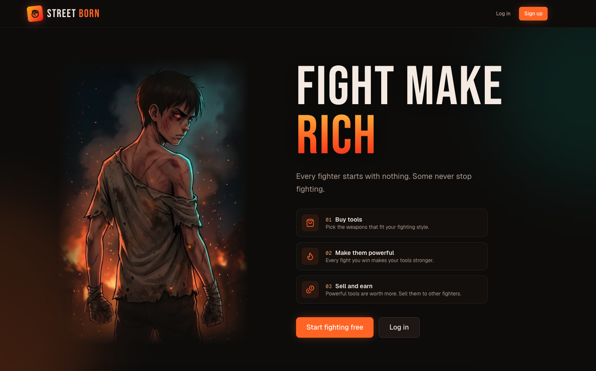

# Street Born



Street Born is a story-driven street fighting game that you play in the browser.

## The story

A thin, hungry boy lives alone in a broken village house. One night bandits burn his home down and come after him, first with a hammer, then a knife, and finally a gun. He survives, and a fighter from a street club offers him a place. You play as that boy, and every fight makes him a little harder to beat.

## How the game works

- The story is split into chapters, and each chapter is a run of fights.
- Before each fight, a few short story slides show what happens next. You can read them or skip straight to the fight.
- Knock out your opponent before the time runs out to win. The faster you win, the more stars you earn, up to three.
- If you lose, you can try again straight away.
- The first fight of chapter 1 is free. To keep playing, you unlock whole chapters, either one at a time or several at once for a discount.
- You pay by card. Paying from a crypto wallet such as MetaMask is being built.
- Coming later: buy tools like an iron pipe or a scrap shield, make them stronger by fighting with them, and sell them to other players.

## Fight controls

| Key | Action |
| --- | --- |
| A and D | Move left and right |
| J | Punch |
| K | Kick |
| L (hold) | Block |
| Space | Dodge |
| Esc | Pause |

On a phone or tablet, the game shows touch buttons on the screen instead.

## Install and run it on your computer

You need:

- [Docker Desktop](https://www.docker.com/products/docker-desktop/)
- [Node.js](https://nodejs.org/) version 22 or newer

Then, from the project folder:

1. Copy the settings file: `cp .env.example .env`, then open `.env` and set `JWT_SECRET` to a long random value, for example the output of `openssl rand -base64 48`.
2. Start the game server: `make docker-up`
3. Load the story and fighters: `make seed`
4. Start the website:

   ```bash
   cd frontend
   npm install
   npm run dev
   ```

5. Open http://localhost:3000 in your browser.

To stop everything, press Ctrl+C in the website window and run `make docker-down`.

## Play

1. On http://localhost:3000, click **Sign up** and create an account.
2. Open the local inbox at http://localhost:8025 and click the activation link in the welcome email. No real email is sent while you play locally.
3. Log in and go to **Fight**. Your next fight is waiting there.
4. Read the story slides, or press **Skip**, then press **Play** and fight.

### Unlocking more chapters

When you reach a locked chapter, press **Unlock chapters** and choose a plan.

Card payments run in Stripe test mode, so no real money is charged.

1. Create a free [Stripe](https://stripe.com/) account and copy its test secret key into `STRIPE_SECRET_KEY` in `.env`.
2. Install the [Stripe CLI](https://docs.stripe.com/stripe-cli), run `stripe listen --print-secret` and copy the result into `STRIPE_WEBHOOK_SECRET`.
3. Restart the game server with `make docker-up`, and keep `make stripe-listen` running in another window while you play.
4. Pay with the card number `4242 4242 4242 4242`, any future expiry date and any security code.

Without these keys the game still works, but chapters cannot be unlocked.

## For developers

How the game is built, the full list of commands, the API and the database are explained in the [technical guide](docs/technical-guide.md).
